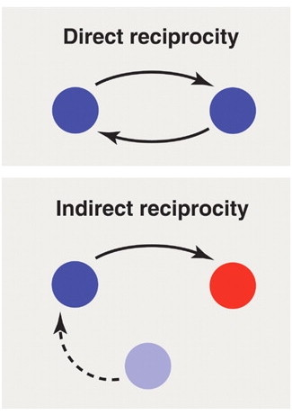

```{r setup, include=FALSE}
knitr::opts_chunk$set(echo = FALSE)
```

## Social dilemma's

<div style="float: left; width: 50%;">
{width=100%}

@michigan_creative
</div>

```{r, echo = F, message = F, warning = F}
library(tidyverse)
library(knitr)
library(kableExtra)

data.frame("C" = c("(8, 8)", "(9, 5)"), 
           "D" = c("(5, 9)", "(6, 6)"),
           row.names = c("C", "D")) %>%
  kable() %>%
  kable_styling(bootstrap_options = c("striped", "hover"),
                full_width = FALSE)
```


<br>
<br>
<br>

Many everyday interactions can be characterized as social dilemma's!

<div class="notes">

This is my *note*.

- It can contain markdown
- like this list

</div>


## Embeddedness

<div style="float: left; width: 50%;">

@nowak_five_2006
</div>

- Dyadic embeddedness 
    - Dyadic control

<br>
<br>
<br>


- Network embeddedness
    - Network control

## Network control effects

```{r studies-table, echo = FALSE, message = FALSE, warnings = FALSE}
tibble(`Study`        = c("@buskens_weesie_experiment_2000",
                          "@bolton_electronic_2004",
                          "@seinen_schram_social_2006",
                          "@barrera_buskens_third_2009",
                          "@buskens_raub_veer_triads_2010",
                          "@miltenburg_buskens_triads_2012",
                          "@pfeiffer_etal_value_2012",
                          "@corten_etal_reputation_2016",
                          "@frey_buskens_investments_2019"),
       `Game`         = c("Vignette Experiment",
                          "Trust Game",
                          "Helping Game",
                          "Investment Game",
                          "Trust Game",
                          "Trust Game",
                          "Prisoner's Dilemma",
                          "Prisoner's Dilemma",
                          "Trust Game"),
       `Form of embeddedness` = c("Dyadic and network",
                                  "Network",
                                  "Network",
                                  "Dyadic and network",
                                  "Dyadic and network",
                                  "Dyadic and network",
                                  "Network", 
                                  "Network",
                                  "Dyadic and network"),
       `Tests on network control effects` 
          = c("Confirmed",
              "Confirmed",
              "No test (positive trend)",
              "Not confirmed",
              "Undecisive",
              "Not confirmed",
              "No test (positive trend)",
              "Not confirmed",
              "Confirmed")
       )[-1,] %>%
  kable() %>%
  kableExtra::kable_styling(bootstrap_options = "striped",
                            font_size = 16)
```

# So, what do we know?

## Hypotheses

- More first round cooperation under network embeddedness.

- Cooperation can be sustained for a longer period under network embeddedness.

## Aggregating evidence

- In every study, we can test for network control effects.

- Meta-analysis is not feasible

- Bayesian Evidence Synthesis [@kuiper_combining_2013]!

## Objective

- Aggregate the evidence for a network control effect.

- Comparison with dyadic control effect.

- Apply and illustrate Bayesian Evidence Synthesis.

<style>
slides > slide { overflow: scroll; }
slides > slide:not(.nobackground):after {
  content: '';
}
</style>

## References {.smaller}


